<div align="center">
  <h1>Hi there, I'm Chen Yongsai 👋</h1>

  <p>
    <a href="mailto:chenys53@mail2.sysu.edu.cn">
      
    </a>
    <a href="mailto:yongsaich@foxmail.com">
      
    </a>
    <a href="mailto:nalalyx845@gmail.com">
      
    </a>
    <a href="https://github.com/RobotChen21">
      
    </a>
  </p>

  <p>
    <i>Currently debugging life on branch: <code>feat/learn-large-models</code> | PR Status: pending ⏳</i>
  </p>
</div>

<br/>

<div align="center">
  
</div>

<br/>

- 🏫 **M.S. in CS** @ Sun Yat-sen University (2025-2028)
- 🎯 **B.E. in Network Eng.** @ Xidian University (2021-2025)
- 🔭 **Focus**: LLM Fine-tuning (SFT/DPO) & Model Alignment (RLHF)
- 💡 **Passion**: Clean Arch & DDD

<br/>

```java
public class Developer {
    private String name = "Chen Yongsai";
    private String[] roles = { "Backend Engineer", "LLM Application Developer" };
    
    public String[] getLocation() {
        return new String[]{"Guangzhou", "Shenzhen"};
    }
}
```

<div align="center">
  <h2>🛠️ Tech Stack</h2>

  <h3>Backend & Microservices</h3>
  <p>
    
    
    
    
    
    
    <br/>
    
    
  </p>

  <h3>LLM & AI Stack</h3>
  <p>
    
    
    
    
    <br/>
    
    
    
    
    
  </p>

  <h3>Tools & DevOps</h3>
  <p>
    
    
    
    
    
  </p>
</div>

## 🚀 Featured Projects

### 🎯 [Cloud-Native Campus](https://github.com/RobotChen21/cloud-native-campus)
> **Microservices Architecture Design & High-Concurrency Community Optimization** | *Refactoring & Performance Tuning*

A comprehensive microservices-based online education platform. Focused on performance bottleneck analysis and system refactoring for the interactive community (comments & likes) and promotion modules.

**Highlights:**
- 🔄 **Interaction Refactoring**: Designed **Hot/Cold Data Separation**: hot data (3 months) in Redis ZSet for ms-level response; cold data in DB with **Bloom Filter** to block invalid queries (latency 200ms+ → 10ms). Solved high-concurrency write bottlenecks using **MQ + Local Write-Behind**.
- 🛡️ **Concurrency Optimization**: Implemented **Redisson + Lua** double atomic validation to prevent overselling/over-claiming. Used **Sequence Space Mapping** for massive redemption code generation and **BitMap** for deduplication, reducing memory by **98%** with O(1) checks.
- ⚙️ **System Governance**: Built **Hotspot Dual-Mode Engine** (Global Aggregation + Local Caffeine Downgrade). Designed application-layer **CDC simulation** for **ES partial updates** to avoid data coverage risks. efficiently handled **BigKeys** via **xxl-job sharded broadcasting** and async deletion.

**Tech Stack**: `Spring Boot` `Spring Cloud` `MySQL` `Redis` `RabbitMQ` `xxl-job` `Elasticsearch` `Caffeine` `Redisson`

---

### 💘 [Digital Matchmaker](https://github.com/RobotChen21/digital-matchmaker-recommand)
> **AI-Native Dating Recommendation Engine** | *Solo Full-Stack Project*

*Because `SELECT * FROM users WHERE perfect_match = true` never finds true love 😄*

An AI-powered dating platform replacing forms with conversational profiling.

**Key Innovations:**
- 🤖 **Agentic Workflow**: LangGraph-orchestrated multi-turn dialogue with state persistence
- 🧠 **Model Alignment**: DeepSeek → SFT/DPO distilled fine-tuning for natural tone
- 🚀 **Inference**: vLLM + Multi-LoRA (90% cost reduction vs API)
- 🔍 **Hybrid Retrieval**: MongoDB (Filter) → ElasticSearch (KNN/BM25) → RAG (Psych Ranking)

**Tech Stack**: `Python` `FastAPI` `LangGraph` `vLLM` `LLaMA Factory` `Elasticsearch` `MongoDB`

---

## 📊 GitHub Stats

<div align="center">   
     
   
</div> 
<br/> 
<div align="center">   
   
</div>

## 🏆 Achievements

- 🥇 **MCM/ICM Finalist** (Top 3% globally in Mathematical Contest in Modeling)
- 📜 **CET-4/6 Certificates**
- 🏅 University Scholarships (4×)

## 💭 Philosophy

> "Code is poetry written in logic. I don't just implement features — I architect solutions, optimize performance, and obsess over clean design patterns."

- 🔬 **Deep Diver**: Digging into source code & principles
- 📚 **Documentation**: Official docs > Tutorials
- 🎯 **Quality**: Strict adherence to standards
- 🤝 **Collaboration**: Git Flow & Code Review advocate

## 📈 Current Learning Path

```mermaid
graph TD
    %% 定义样式类
    classDef ai fill:#e1f5fe,stroke:#01579b,stroke-width:2px,color:#01579b;
    classDef be fill:#fff3e0,stroke:#e65100,stroke-width:2px,color:#e65100;
    classDef goal fill:#e8f5e9,stroke:#1b5e20,stroke-width:4px,color:#1b5e20;

    subgraph LLM_Path [🤖 AI & LLM Specialization]
        direction TB
        A[LLM Fundamentals]:::ai --> B[Fine-tuning SFT/DPO]:::ai
        B --> C[Model Alignment RLHF]:::ai
        C --> D[RAG & Vector DB]:::ai
        D --> E[Agentic Workflows]:::ai
    end

    subgraph Backend_Path [🛠️ Backend & Architecture]
        direction TB
        F[Business Logic & CRUD]:::be --> G[Microservices & RPC]:::be
        G --> H[DDD & Clean Arch]:::be
        H --> I[High Concurrency/Performance]:::be
        I --> J[Distributed System Design]:::be
    end

    %% 两条路最终汇聚的目标
    E --> K[Build AI-Native Applications]:::goal
    J --> K
```


